# XActions 操作谱系图

> 当前版本：v3.5.0。本文档按当前仓库实际注册的 CLI 命令和 MCP 工具整理。

## 总览

```mermaid
%%{init: {'theme': 'base', 'flowchart': {'curve': 'basis'}}}%%
flowchart TD
    ROOT["XActions v3.5.0\n单账号 X 运营能力"]

    ROOT --> ACCESS["接入层"]
    ROOT --> READ["读取与发现"]
    ROOT --> ANALYTICS["分析与决策"]
    ROOT --> CONTENT["内容生产"]
    ROOT --> WRITE["账号写操作"]
    ROOT --> AUTOMATION["自动化运营"]
    ROOT --> MONITOR["监控与触发"]
    ROOT --> DATA["数据与协作"]

    ACCESS --> CLI["CLI"]
    ACCESS --> MCP["MCP 154 tools"]
    ACCESS --> API["REST API"]
    ACCESS --> DASHBOARD["Dashboard"]
    ACCESS --> BROWSER["Browser Scripts"]

    CLI --> AUTH["登录态\nconnect / login / doctor"]
    MCP --> APPROVAL["审批门\n草稿 / 批准 / 丢弃"]

    READ --> ACCOUNT["账号读取\nprofile / tweets / thread / media"]
    READ --> SOCIAL["社交图谱\nfollowers / following / non-followers"]
    READ --> SEARCH["搜索发现\nsearch / hashtag / scrape"]
    READ --> INBOX["时间线与收件箱\nhome / notifications / bookmarks / DMs"]
    READ --> SPACE_READ["Spaces 与媒体\nspaces / transcript / download"]

    ANALYTICS --> ACCOUNT_ANALYTICS["账号分析\nreport / history / growth"]
    ANALYTICS --> ENGAGEMENT_ANALYTICS["互动分析\npost / engagement / sentiment"]
    ANALYTICS --> AUDIENCE_ANALYTICS["受众分析\noverlap / bots / influencers"]
    ANALYTICS --> CONTENT_ANALYTICS["内容分析\nvoice / best time / evergreen"]

    CONTENT --> AI_WRITER["AI 写作\ngenerate / rewrite / optimize"]
    CONTENT --> IDEATION["内容策划\nhashtags / predictions / variations"]
    CONTENT --> PERSONA["Persona\ncreate / edit / run / status"]
    CONTENT --> CALENDAR["日历与草稿\nschedule / RSS / workflows"]

    WRITE --> POST["发布\npost / thread / poll / article / quote"]
    WRITE --> ENGAGE["互动\nlike / retweet / reply / bookmark"]
    WRITE --> RELATIONSHIP["关系管理\nfollow / unfollow / mute / protect"]
    WRITE --> PROFILE["资料设置\nupdate profile / delete post"]
    WRITE --> DM["私信\nsend / list / export"]

    AUTOMATION --> TARGETED["定向运营\nengage / follow engagers"]
    AUTOMATION --> BULK["批量操作\nbulk / auto-like / auto-comment"]
    AUTOMATION --> CLEANUP["关系清理\nsmart unfollow / unfollow all"]
    AUTOMATION --> PIPELINES["工作流\ncreate / run / schedule"]

    MONITOR --> ACCOUNT_MONITOR["账号监控\naccount / follower alerts"]
    MONITOR --> KEYWORD_MONITOR["品牌与关键词\nbrand / keyword monitor"]
    MONITOR --> STREAMS["实时流\nstart / pause / resume / history"]
    MONITOR --> NOTIFY["通知\nemail / Slack / Discord / Telegram"]

    DATA --> EXPORT["导出与迁移\nexport / archive / convert / migrate"]
    DATA --> CRM["粉丝 CRM\nsync / tag / search / segment"]
    DATA --> GRAPH["关系图\nbuild / analyze / recommendations"]
    DATA --> TEAM["团队与数据集\nteam / dataset / import"]

    APPROVAL -.-> WRITE
    APPROVAL -.-> AUTOMATION
    AUTH -.-> READ
    AUTH -.-> WRITE
    AUTH -.-> AUTOMATION

    classDef root fill:#111827,color:#fff,stroke:#111827,stroke-width:2px;
    classDef layer fill:#dbeafe,color:#172554,stroke:#2563eb;
    classDef access fill:#dcfce7,color:#14532d,stroke:#16a34a;
    classDef risk fill:#fee2e2,color:#7f1d1d,stroke:#dc2626;
    class ROOT root;
    class ACCESS,READ,ANALYTICS,CONTENT,WRITE,AUTOMATION,MONITOR,DATA layer;
    class CLI,MCP,API,DASHBOARD,BROWSER,AUTH access;
    class APPROVAL,WRITE,AUTOMATION,DM,BULK,CLEANUP risk;
```

完整的 Mermaid 源文件位于 [`xactions-operations-lineage.mmd`](xactions-operations-lineage.mmd)，可以导入 Mermaid Live、Obsidian、Notion 或其他 Mermaid 渲染器。

## 能力层级

| 层级 | 主要能力 | 登录态 | 推荐入口 |
|---|---|---:|---|
| 接入 | CLI、MCP、REST、Dashboard、Browser Scripts | 视操作而定 | CLI/MCP |
| 读取 | 账号、推文、线程、媒体、搜索、粉丝、时间线 | 部分需要 | CLI `profile`、MCP `read` |
| 分析 | 账号、受众、互动、情感、声誉、内容表现 | 通常需要 | CLI `analyze`、MCP `analytics` |
| 内容 | 生成、改写、优化、标签、Persona、日历 | AI 能力可选 | CLI `ai`、MCP `ai` |
| 写操作 | 发帖、回复、点赞、转发、关注、私信、资料修改 | 需要 | MCP `write`、CLI `engage` |
| 自动化 | 批量互动、定时任务、工作流、Persona Agent | 需要 | MCP `automation`、`workflows` |
| 监控 | 账号、关键词、品牌、实时流、通知 | 视数据源而定 | MCP `monitoring` |
| 数据 | 导出、导入、CRM、图谱、迁移、团队 | 视数据源而定 | MCP `data` |

## 关键边界

- `read` 主要是读取和分析，不直接改变账号状态。
- `write`、`dm`、`automation` 可能改变账号状态，应在执行前生成计划。
- MCP 设置 `XACTIONS_MCP_REQUIRE_APPROVAL=1` 后，写操作会进入草稿审批流程。
- 登录 Cookie 只保存在本机，不应进入文档、日志、Git 或 AI 提示词。
- 批量点赞、批量关注、批量回复、陌生人私信等操作应显式启用并设置低额度。

## 从图进入文档

- AI Agent 使用方法：[`ai-usage-manual.md`](ai-usage-manual.md)
- MCP 配置：[`mcp-setup.md`](mcp-setup.md)
- 工作流：[`workflows.md`](workflows.md)
- 自动化框架：[`automation.md`](automation.md)
- CLI 参考：[`cli-reference.md`](cli-reference.md)
